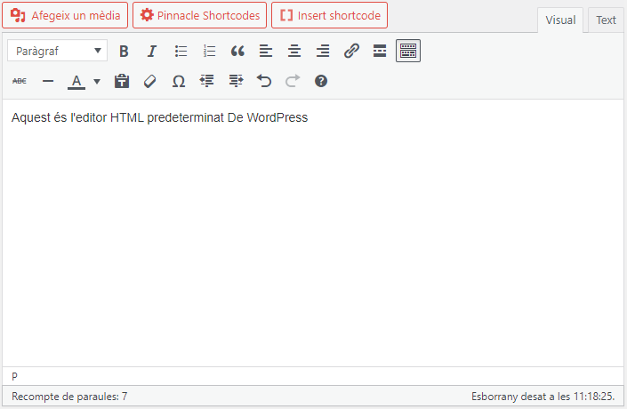
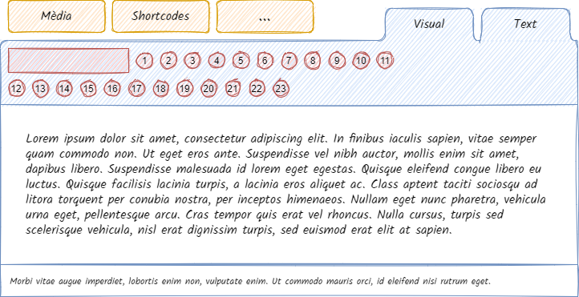
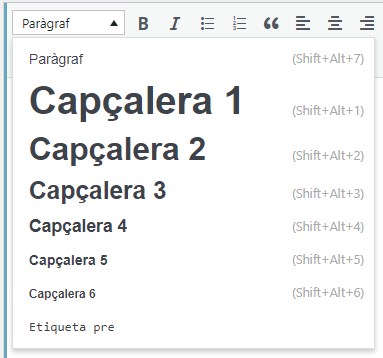

# L'editor de text

<link rel="stylesheet" href="../estils.css" />

L'editor de text de WordPress és similar als editors de text normals.

<!--      -->



<div class="hint danger">Podem alinear el text a l'esquerra, al centre i a la dreta (eines 6, 7 i 8 respectivament). Mai es justifica el text pels dos costats.</div>

<div class="hint warning">L'editor de text no permet canviar la mida de la lletra ni el color. Aquestes opcions no són necessaries per l'edició de textos. Si cal destacar un text a mode de títol, utilitzeu la <a href="#encapçalaments">opció de encapçalaments</a>.</div>

## Encapçalaments

Per tal de mantenir una coherència estètica, el blog té definit una estètica per la jerarquia de títols. Des de l'editor de text es pot etiquetar un text com a títol i aquest ja es visualitzarà amb l'estètica que li toca.

Etiquetar un text com a títol:

1. Seleccionar el text en qüestió.
2. Localitzar i dirigir-nos al desplegable.
3. Seleccionar el nivell d'encapçalament.



## Enllaços

Si cal que un text estigui enllaçat a una altra pàgina cal:

1. Seleccionar el text en qüestió.
2. Clicar l'opció 9 <span class="material-icons">insert_link</span> de l'editor.
3. Escriure l'adreça a la qual cal enllaçar.

### Editar els enllaços

Un cop creat un enllaç, podem fer clic a sobre i trobem dues opcions:

* Editar l'enllaç <span class="material-icons">edit</span>
* Eliminar l'enllaç <span class="material-icons">link_off</span>

Si cliquem la icona del llapis edit, <span class="material-icons">edit</span> l'enllaç, podem modificar l'adreça que hi havíem posat. També ens apareix la icona de l'engranatge <span class="material-icons">settings</span>, que ens porta a les opcions avançades.

Aquí és on podem fer que l'enllaç s'obri en una **pestanya nova**.

<div class="hint success">Si fem un enllaç a una altra pàgina del mateix blog, és millor que no s'obri en una pestanya nova, però si l'enllaç va a una pàgina externa, recomanem configurar-lo per què s'obri en una pàgina nova.</div>

## Multimèdia

Per afegir una foto, vídeo, àudio o document que estigui penjat a la mediateca, clicar el botó `Afegeix un mèdia` i seleccionar l'element de la mediateca que hi vulguem posar. Per entendre millor com funciona la mediateca, vista la [secció de mediateca](../posttypes/media.md).

## *Shortcodes* (codis de substitució)

A vegades podem necessitar contingut molt més complex de crear. Per tal de permetre als editors afegir funcionalitats més avançades sense necessitar coneixements d'HTML, WordPress ofereix els *shorcodes*.

Els shortcodes són fragments de codi del tipus:

```
[btn text="UVic" tcolor="red" link="https://uvic.cat"]
```

El codi anterior, representa un botó que diu "UVic", que és de color vermell i que quan es clica va a uvic.cat.

### Com afegir shortcodes?

ls shortcodes es poden escriure a l'editor directament, però cal saber-se les formules. Com que aquests depenen del tema i els plugins que hi hagi instal·lats al blog, no hi ha una llibreria concreta on es puguin consultar els shorcodes disponibles, però tenim alguns plugins que afegeixen els shorcodes per nosaltres:

1. Des de l'editor de text, situem el cursor al punt on volem afegir el shortcode.
2. Fem clic al botó "Insert shortcode" o "Pinnacle Shortcodes" (només disponible per a blogs amb la plantilla pinnacle).
3. Si ens surt un quadre de diàleg, el completem amb la informació necessària.
4. Cliquem al botó "Insert Shortcode"
5. Observem que s'ha afegit el codi al cos de la pàgina.gs amb la plantilla pinnacle).
