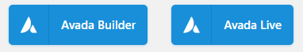

# Editors Visuals

<link rel="stylesheet" href="../estils.css" />

A més de l'editor per defecte, es poden instal·lar altres editors amb més funcionalitats i més fàcils d'utilitzar. A continuació es detallen els editors que hi ha instal·lats a la xarxa.

Cada editor està vinculat a una plantilla, per descobrir quin editor has d'utilitzar, has de tenir clar <a href="../introduccio/plantilles.md#com-saber-quin-tema-utilitza-el-teu-blog">quina plantilla utilitza el teu blog</a>.

## Com funcionen els editors visuals

1. Activar l'editor
2. Crear una fila (o les que calgui)
3. Definir el nombre de columnes que hi ha d'haver a la fila que hem creat (amb les seves corresponents proporcions)
4. Afegir elements a dins les columnes

Sempre es podran modificar la disposició de files i columnes definida a l'inici.

## Editors

### Visual composer (plantilla Albertino)

Per activar l'edició amb aquest editor cal clicar el botó "Editor del tauler":

### Site Origin (plantilla Pinnacle)

Per activar l'edició amb aquest editor cal la pestanya "Page Builder" a les pestanyes del mode d'edició:

### Avada Builder (plantilla Avada)

Per activar l'edició amb aquest editor cal clicar el botó "Avada Builder":

