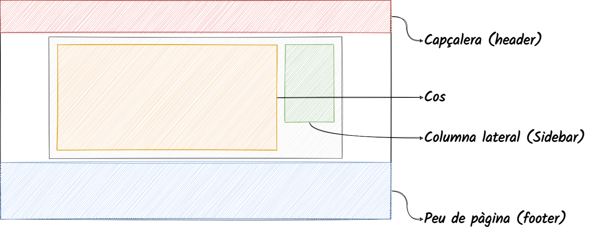
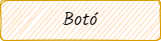
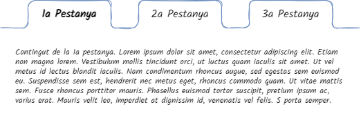
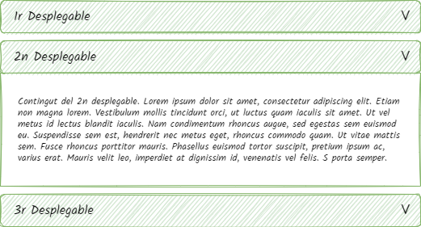
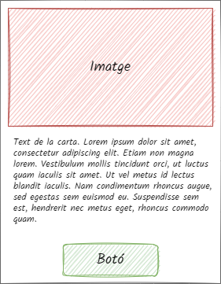

# Vocabulari general

<link rel="stylesheet" href="../estils.css" />

## Zones d'un blog

* **Capçalera**: la capçalera és la part superior del blog i mostra el menú principal, el títol del blog i altres informacions destacables. Totes les pàgines contenen aquest element.
* **Cos**: el cos és una zona diferent per cada pàgina del blog.
* **Columna lateral**: algunes pàgines, com les notícies, poden mostrar aquesta columna amb ginys, informacions o el que convingui.
* **Peu de pàgina**: el peu de pàgina correspon al final de la pàgina. No tots els blogs en tenen, però és un espai on s'hi pot incloure informació de contacte, logotips de col·laboradors, enllaços de notícies...

## Tipus de contingut

Hi ha molts tipus de contingut diferents a WordPress. Els que més utilitzem són els següents:

* **Entrades**: són les notícies que es publicaran a la web i quedaran al *feed* del blog.
* **Pàgines**: són entrades estàtiques que quedaran fora del feed del blog.
* **Staff**: són fitxes per mostrar els membres de l'equip del blog.
* **Esdeveniment**: en cas de voler mostrar una agenda, aquest tipus de contingut representarà cada entrada.
* **Portfoli**: són fitxes de projectes, però es poden utilitzar per a diferents finalitats.

<a href="../posttypes/index.md">Més informació sobre tipus de contingut</a>

<!--
## Menu

Explicar què és un "Menú"

    
<pre class="pendent">
[10:33] Daniel Martínez Lahoz
    mmm, crec que "Menú" s'entén prou bé. Però jo diria que és un apartat d'una pàgina web on l'usuari visualitza els continguts més rellevants i la navegació de la pàgina web
</pre>
-->

## Extensions

Les **extensions o plugins** són scripts que entenen les funcionalitats del blog. Millores les característiques que ja hi ha o afegeixen noves característiques.

Els plugins els solen crear voluntaris i són lliures pel públic.

<a href="../plugins/index.md">Més informació sobre les extensions</a>

## Els ginys

Els **ginys o widgets** afegeixen contingut i característiques a zones específiques del blog (que depenen del tema que utilitzi).

Un **iframe** és un es un element HTML que permet incrustar un document HTML dins d'un document HTML principal. Profanament, és un tros de codi que ens permetrà afegir funcions de tercers a una pàgina.

## Elements visuals

