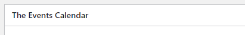

# The Events Calendar

<link rel="stylesheet" href="../estils.css" />

L'extensió [The Events Calendar](https://theeventscalendar.com/) afegeix un calendari a la web en el qual els editors poden afegir esdeveniments. D'aquesta manera els visitants podràn navegar per les pàgines del calendari i visualitzar la informació dels esdeveniments.

[Aprèn més sobre les extensions](./index.md).

## Com funciona l'Events Calendar?

Si aquesta extensió està instal·lada, apareixarà un nou apartat al menú lateral de l'administrador: Esdeveniments. En aquest nou apartat es gestionaràn els esdeveniments de manera similar a com gestionem la resta de [Tipus de Contingut](../posttypes/pagines.md#gestionar-les-pagines).

### Atributs de les esdeveniments

Dins de la pàgina d'edició d'un esdeveniment, apareixarà la caixa "The Events Calendar".

Aquí podrem definir les informacions pròpies de l'esdeveniment.

#### Dates i hores

Cada esdeveniment té una hora d'inici i una hora de fi. Alguns fins i tot poden durar més d'un dia. Aquesta informació es guarda a l'atrbut "inici i fi".

#### Ubicació

Opcionalment, en aquest desplegable pots seleccionar la ubicació de l'esdeveniment.

Per gestionar totes les ubicacions cal anar al punt "Recintes" al menú lateral de l'administrador.

#### Organitzadors

Opcionalment, en aquest desplegable pots seleccionar l'organitzador de l'esdeveniment.

Per gestionar tots els organitzadors cal anar al punt "Organitzadors" al menú lateral de l'administrador.

#### Altres informacions

També podem afegir els següents camps estàtics:

* Web
* Cost

#### Categories i etiquestes

Els esdeveniments també es poden categoritzar i etiquetar tal com passa amb les [entrades](../posttypes/entrades.md#categoria).
