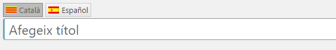

# qTranslate X

<link rel="stylesheet" href="../estils.css" />

L'extensió [qTranslate X](https://qtranslatexteam.wordpress.com/) ens permet tenir el blog en múltiples idiomes.

[Aprèn més sobre les extensions](./index.md).

<div class="hint warning">

Aquesta extensió té implicacions directes al contingut del blog i algunes funcionalitats no s'integren bé. Si no és indispensable tenir el blog en múltiples llengües és millor prescindir d'aquesta extensió.

</div>

## Com funciona

### Traducció de pàgines i entrades

Quan hi ha l'extensió, apareixerà una pestanya per a cada idioma que s'hagi configurat.



### Com traduir textos en camps on no apareixen les pestanyes d'idioma?

Si no apareixen les pestanyes d'idioma, caldrà escriure el codi de manera manual. L'estructura és:

* Etiqueta d'entrada del primer idioma
    * **Català**: `[:ca]`
    * **Castellà**: `[:es]`
    * **Anglès**: `[:en]`
    * **Francès**: `[:fr]`
* Text en el primer idioma
* Etiqueta d'entrada del segon idioma
* Text en el segon idioma
* Repetim en tots els idiomes que calgui
* Etiqueta de tancament

#### Exemple:

```
[:ca]Bon dia[:es]Buenos días[:en]Good morning[:]
```

<table class="puzzle">
	<tr>
		<td><code>[:ca]</code></td>
		<td>Bon dia</td>
		<td><code>[:es]</code></td>
		<td>Buenos días</td>
		<td>[:en]Good morning</td>
		<td><code>[:]</code></td>
	</tr>
	<tr>
		<td>Etiqueta d'entrada del primer idioma</td>
		<td>Text en el primer idioma</td>
		<td>Etiqueta d'entrada del segon idioma</td>
		<td>Text en el segon idioma</td>
		<td>Repetim en tots els idiomes que calgui</td>
		<td>Etiqueta de tancament</td>
	</tr>
</table>
