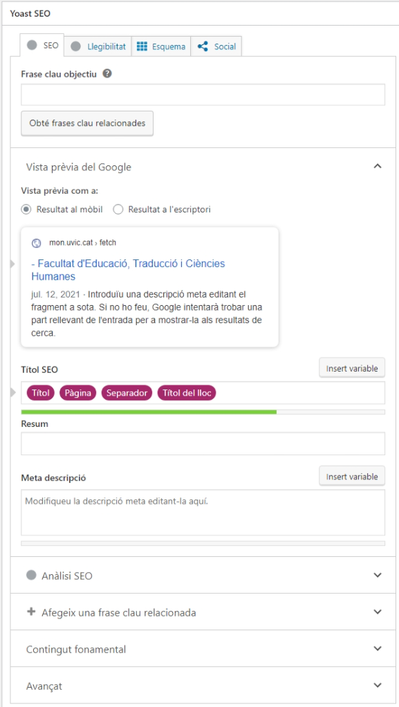

# Yoast SEO

<link rel="stylesheet" href="../estils.css" />

El [Yoast SEO](https://ca.wordpress.org/plugins/WordPress-seo/) és una extensió que ajuda als editors de crear contingut posicionable en cercadors.

[Aprèn més sobre les extensions](./index.md).

    
El <strong>SEO</strong> (Search Engine Optimization) són les accions que ajudaran al fet que el web aparegui als primers resultats de Google (o altres cercadors) quan algú faci una determinada cerca.

    
Si no domines el tema SEO, et recomanem llegir <a href="https://www.uvic.cat/sites/default/files/manual_seo_-_marqueting.pdf">la guia de SEO</a> abans d'utilitzar aquesta extensió.

## Com funciona el Yoast SEO?

Quan treballem amb el Yoast, a l'editor de les pàgines i entrades apareixerà una nova secció: **Yoast SEO**.

En aquesta pantalla podem definir diferents coses:

* Pestanya "SEO"
    * **Frase clau objectiu**: la frase que volem que posicioni (què han d'escriure els usuaris al cercador perquè els aparegui aquesta pàgina).
    * **Resum**: el text que apareixerà al costat de l'adreça a la llista de resultats dels navegadors.
    * **Meta descripció**: la breu descripció que apareixerà a la llista de resultats dels navegadors. D'aquesta descripció dependrà que molts usuaris entrin a la web o no.
* Pestanya "Llegibilitat"
    * Aquí s'analitza el text i es compta quants cops apareixen les paraules clau i fa un balanç entre la densitat de paraules clau i la llegibilitat del text.
